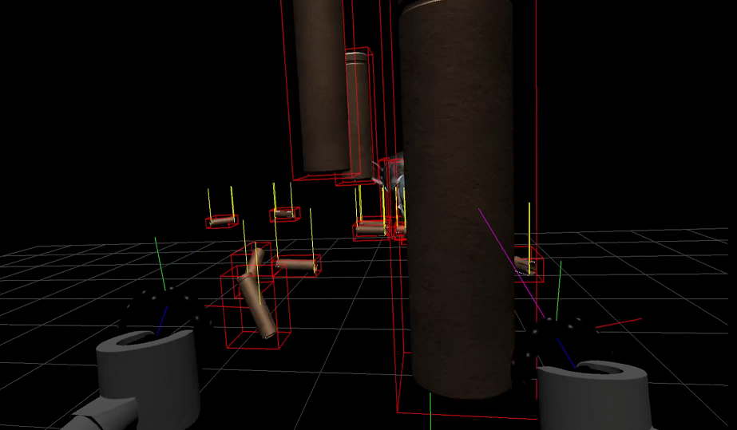

Chime
=====

Chime is an experimental VR demo showing various neat 3D graphics techniques, implemented in C# with Direct3D11 rendering.

Chime is still very early in development. Areas to build out include:
 - [X] VR headset & motion controller support via OpenVR
 - [X] Basic glTF model loading
 - [ ] Deferred PBR renderer
 - [ ] Mouse, Keyboard, and Gamepad input via RawInput
 - [X] Rigid-body physics simulation via a [custom port](https://github.com/epicabsol/BulletSharpPInvoke/tree/system-numerics-port) of [BulletSharp](https://github.com/AndresTraks/BulletSharpPInvoke) to `System.Numerics`
 - [ ] Procedural physical sky shader
 - [ ] Physical cloud shader
 - [ ] Real-time physics-driven windchime simulation with procedural audio